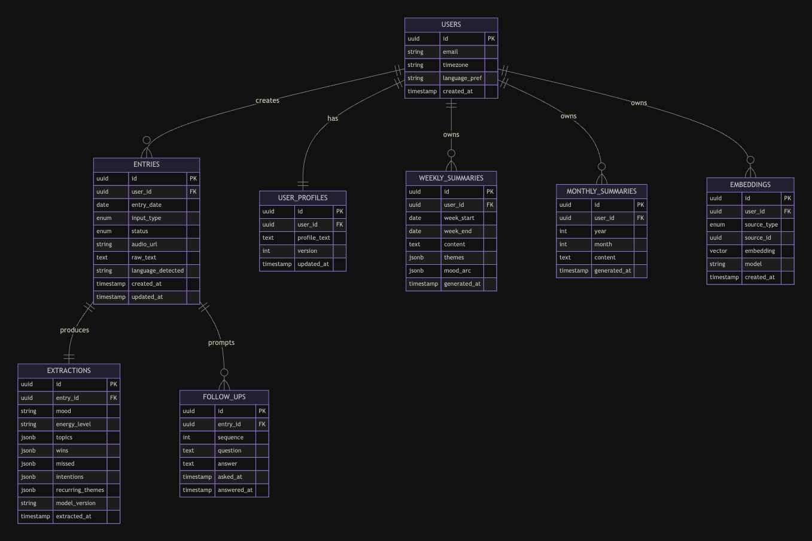

# Sundown

> A daily review assistant that listens, asks better questions, and helps you see the patterns in your own days.

Sundown is an AI-powered journaling app built around a simple idea: the most useful thing you can do at the end of a day is dump it out of your head — honestly, messily, in whatever language you think in — and let something thoughtful read it back to you over time.

You speak or type a 2-minute brain dump each evening. Sundown extracts what mattered, asks a few targeted follow-up questions based on what you actually said (not a generic template), and quietly builds a memory of your weeks, months, and themes. On Sunday, it shows you what it noticed.

It supports English, Nepali (Devanagari), and Romanized Nepali, including free code-switching between them.

---

## Why it exists

Most journaling apps fail for the same reasons: rigid prompts that punish you for not having a "win" today, no memory beyond the current entry, and a UX that turns reflection into form-filling. The successful ones (paper notebooks, voice memos) work because they get out of the way.

Sundown tries to keep that frictionless input while doing something paper can't: read across your weeks and tell you what's actually been going on. Not motivation, not gamification — just an honest mirror with a long memory.

---

## How it works

Sundown is built around three layers that solve different parts of the long-term memory problem:

**Capture layer.** Free-form text or voice input. No fields to fill. Voice gets stored first and transcribed in the background, so submitting a dump never blocks on a slow speech-to-text pipeline. Whisper handles transcription locally; you can edit transcripts before they're processed further.

**Extraction layer.** Each entry is parsed by Claude into a structured record — mood, topics, wins, missed intentions, recurring themes — using tool-use schemas for reliable JSON output. The raw text is kept forever as the source of truth; structured data is regenerable.

**Memory layer.** Hierarchical summaries (daily → weekly → monthly) compress meaning into readable text. Embeddings of both raw entries and summaries enable semantic search via pgvector. When you ask Sundown a question about your history, it retrieves the right granularity for the question — summaries for "how was last month," raw entries for "what happened on the 14th."

The follow-up questions you see during a check-in are streamed via Claude Haiku for low-latency UX. Heavier work — full extraction, weekly summaries, profile updates — runs in background jobs.

## Model

Here is a simple model of how Sundown works, available in [docs/models.excalidraw](docs/models.excalidraw)



---

## Tech stack

- **Backend:** Python, FastAPI, async-native
- **Database:** PostgreSQL with pgvector for embeddings
- **AI:** Anthropic Claude (Haiku for interactive paths, Sonnet for summaries and extraction)
- **Speech-to-text:** faster-whisper, running locally
- **Background jobs:** arq (Redis-based)
- **Storage:** S3-compatible object storage for audio
- **Frontend:** Minimal web UI (mobile-first)

---

## Status

Sundown is in active development as a personal project. It is not currently a hosted service — there's no public sign-up. The codebase is open so others can fork it, learn from it, or run their own instance.

**Working:**

- Coming Soon

**In progress:**

- Text-based daily check-in with streaming follow-up questions
- Structured extraction with Claude tool use
- Postgres schema with raw + structured + embedding storage
- Voice input with async transcription
- Weekly summary generation
- Semantic search across entry history

**Planned:**

- Maintained user-profile document updated after each entry
- Eval harness for prompt iteration
- Mobile-friendly UI polish
- Optional notification system for daily reminders

---

## Running your own instance

Sundown is designed to be self-hosted. You'll need:

- Python 3.11+
- PostgreSQL 15+ with the `pgvector` extension installed
- Redis (for background job queue)
- An Anthropic API key
- Object storage (S3, R2, or local disk for development)

```bash
git clone https://github.com/<your-username>/sundown.git
cd sundown
cp .env.example .env  # fill in API keys and database URL
uv sync               # or: pip install -e .
alembic upgrade head  # set up the database schema
uv run uvicorn sundown.main:app --reload
```

In a separate terminal, start the worker:

```bash
uv run arq sundown.worker.WorkerSettings
```

The app will be available at `http://localhost:8000`. See [`docs/setup.md`](docs/setup.md) for full configuration, including Whisper model selection, language settings, and deployment notes.

---

## Language support

Sundown is built to be honest about how multilingual users actually write. The system prompts are designed around the assumption that users may write in:

- English
- Nepali (Devanagari script)
- Romanized Nepali ("aaja office ma kaam thiyo")
- Mixed / code-switched text

The extraction layer handles all four without translation — entries are stored in the language they were written in, and follow-up questions are returned in the same register the user used. Whisper supports Nepali transcription, with the option to swap in a community fine-tuned model for better accuracy.

---

## Design principles

A few decisions worth being explicit about:

**Unstructured input, structured extraction.** Forms kill journaling. The user types whatever; the model handles the structure invisibly.

**Frictionless capture, asynchronous engagement.** You can dump and walk away. Follow-ups are waiting when you come back.

**Raw data is canonical.** Summaries and embeddings are derived and regenerable. Nothing important is ever only a summary.

**Match model to moment.** Fast paths use small models. Reflective paths use larger ones. No single "best model" choice.

**Hierarchical memory over fixed context.** Sundown is built for years of entries, not weeks.

---

## License

MIT. Use it, fork it, change it. No warranty, and please don't ship a clone to an app store with the same name — pick your own.

---

## Acknowledgements

Built with [Anthropic Claude](https://www.anthropic.com/), [OpenAI Whisper](https://github.com/openai/whisper) (via faster-whisper), [pgvector](https://github.com/pgvector/pgvector), and a lot of evenings.
